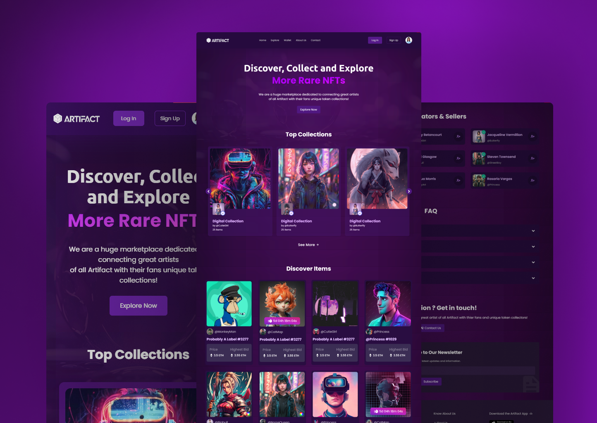

# Digital NFT Website

This is a responsive digital NFT (Non-Fungible Token) website created using HTML, CSS, and JavaScript. The website showcases a sleek image slider section, providing a modern and immersive experience for users interested in exploring digital art through NFTs.

## Features

- Responsive design for optimal viewing on various devices.
- Image slider section for showcasing digital NFT artworks.
- Modern UI design to enhance user engagement.

## Preview



## Getting Started

To run this website locally, follow these steps:

1. Clone the repository to your local machine:
   ```
   git clone https://github.com/Devsethi3/Digital-NFT-Website.git
   ```
2. Open the `index.html` file in your preferred web browser.

## Usage

- Explore the NFT artworks showcased in the image slider.
- Enjoy the seamless and responsive design for a pleasant browsing experience.

## Contributing

If you'd like to contribute to this project, please follow these steps:

1. Fork the repository.
2. Create a new branch for your feature or bug fix.
3. Make your changes and commit them with descriptive messages.
4. Push your changes to your forked repository.
5. Open a pull request to merge your changes into the main branch.

Feel free to explore the website and provide feedback or contribute to its development. Thank you for checking out the Digital NFT Website repository!